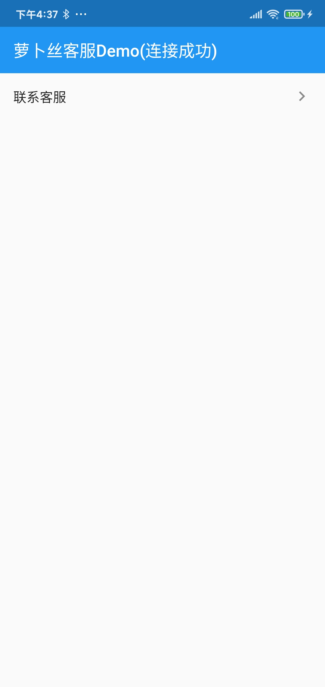
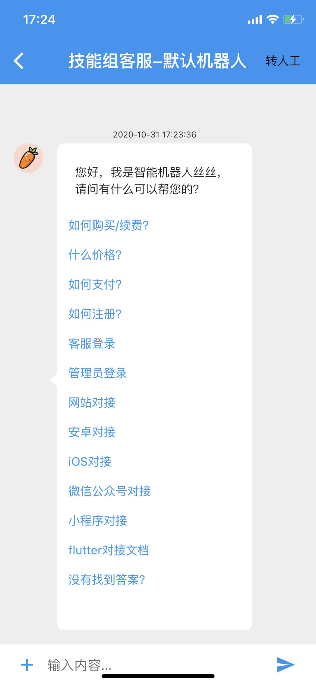
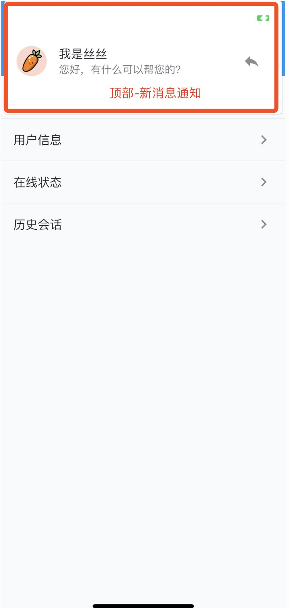
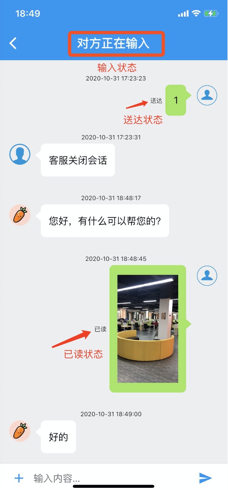
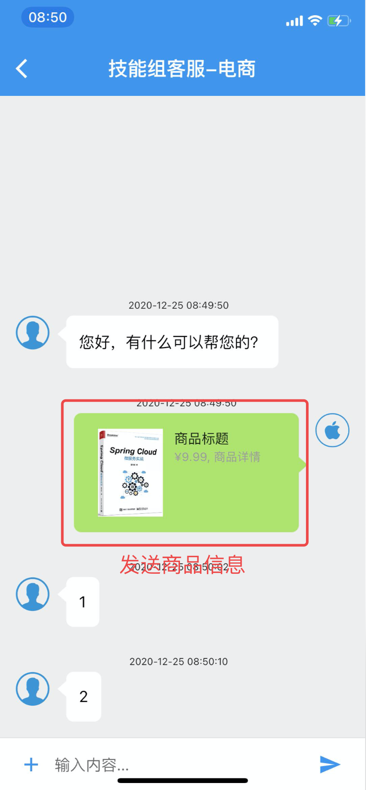
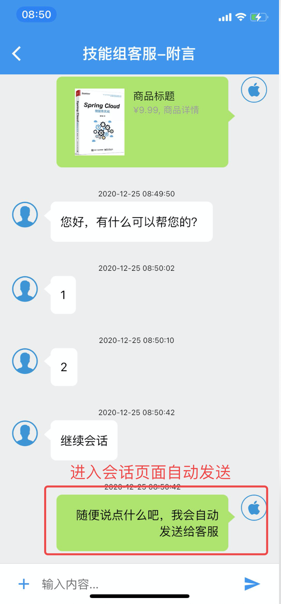
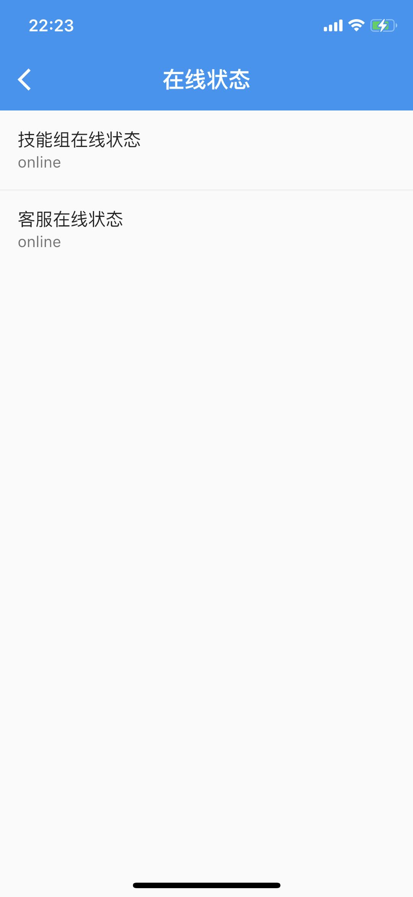
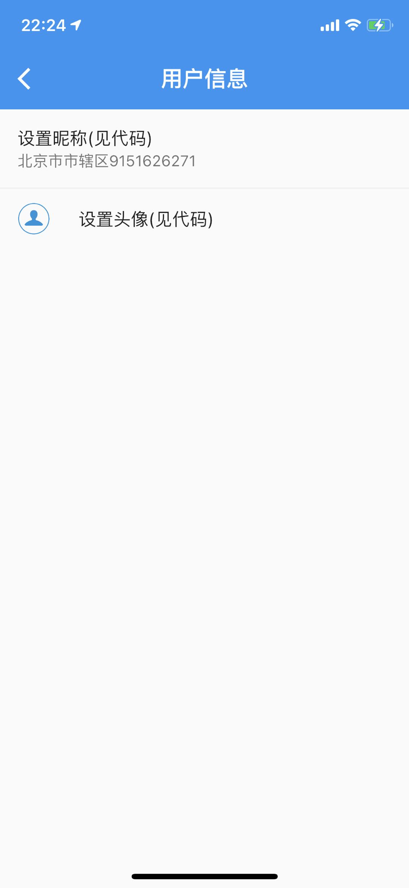

# 萝卜丝客服SDK

萝卜丝(bytedesk) flutter 客服SDK

## 部分功能

- 支持安卓、iOS、Web
- 机器人对话
- 技能组客服
- 一对一客服
- 支持发送电商商品信息
- 支持发送附言消息
- 对接APP用户信息(昵称/头像)
- 获取当前客服在线状态
- 获取历史会话
- 消息提示音/振动设置
- 消息送达/已读
- 消息撤回
- 输入状态(对方正在输入)
- 发送/播放视频
<!-- - 提交工单 -->
<!-- - 意见反馈 -->

## 集成步骤

### 第一步

- pubspec.yaml添加：bytedesk_kefu: ^最近版本号
<!-- - 最新版本：[](https://pub.dev/packages/bytedesk_kefu) -->
- [](https://pub.dev/packages/bytedesk_kefu) | [](https://pub.dev/packages/bytedesk_kefu/score) | [](https://pub.dev/packages/bytedesk_kefu/score) | [](https://pub.dev/packages/bytedesk_kefu/score)
- [注册账号](https://www.bytedesk.com/antv/user/login)

### 第二步：初始化

- 获取appkey，登录后台->客服管理->渠道管理->添加应用->appkey
- 获取subDomain，也即企业号：登录后台->客服管理->客服账号->企业号
- BytedeskKefu.init(appKey, subDomain);

### 第三步：联系客服

- 获取技能组workGroupWid：登录后台->客服管理->技能组->唯一wid
- BytedeskKefu.startWorkGroupChat(context, workGroupWid, "技能组客服wid");

### 集成完毕

| image1 | image2 | image3 |
| :----------: | :----------: | :----------: |
|  |  |  |
|  |  | |
|  | ||

### 自定义界面

- 项目中创建文件夹: vendors
- 去下载最新源码 [sourceCode](https://pub.dev/packages/bytedesk_kefu/versions), 放在 vendors 文件夹中
- pubspect.yaml中填写引用本地源码

```dart
bytedesk_kefu:
    path: ./vendors/bytedesk
```

## 公众号


### 其他

- [官网](https://www.bytedesk.com/)
- [下载 ApkDemo](https://bytedesk.oss-cn-shenzhen.aliyuncs.com/apk/bytedesk-android-sdk-demo.apk)
- 技术支持QQ 3群: 825257535

- [Flutter SDK](https://github.com/bytedesk/bytedesk-flutter)
- [UniApp SDK](https://github.com/bytedesk/bytedesk-uniapp)
- [iOS SDK](https://github.com/bytedesk/bytedesk-ios)
- [Android SDK](https://github.com/bytedesk/bytedesk-android)
- [Web端接口](https://github.com/bytedesk/bytedesk-web)
- [微信公众号/小程序接口](https://github.com/bytedesk/bytedesk-wechat)
- [服务器端接口](https://github.com/bytedesk/bytedesk-server)
- [机器人](https://github.com/bytedesk/bytedesk-chatbot)