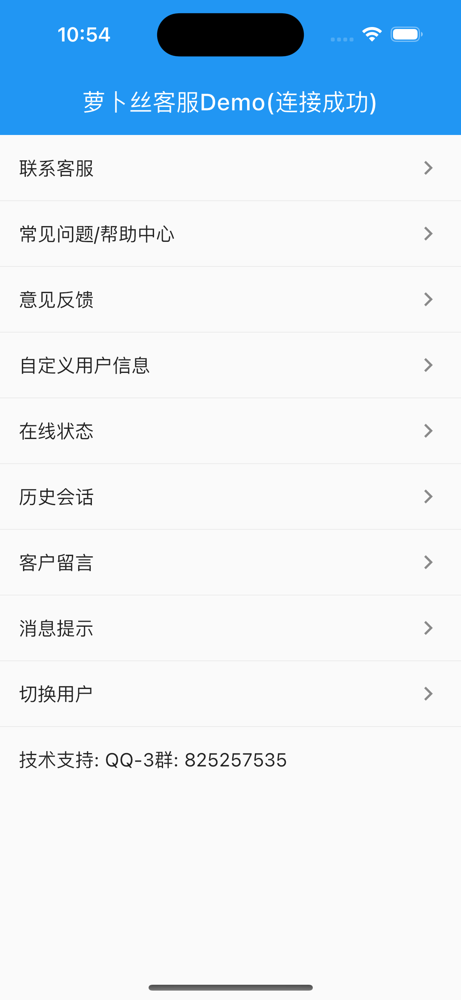
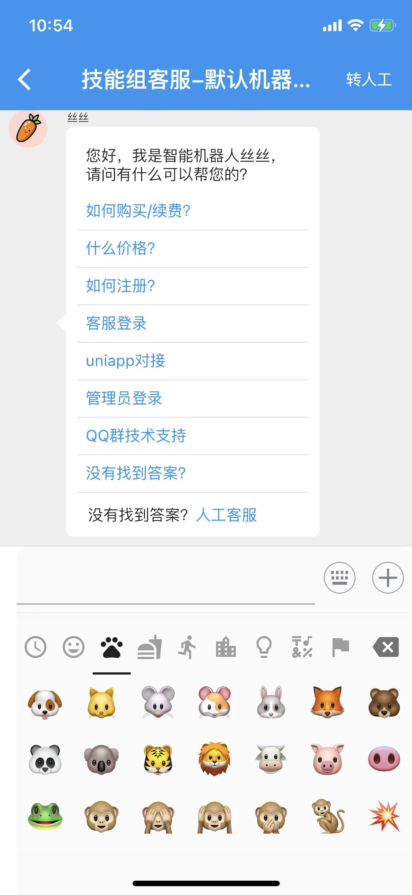
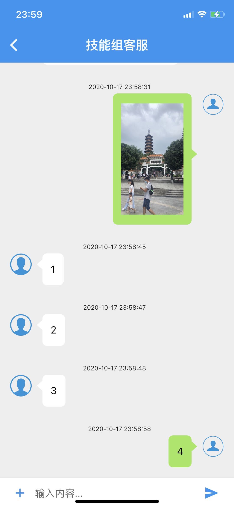

# 萝卜丝客服SDK

萝卜丝(bytedesk) flutter 客服SDK

## 部分功能

- 机器人对话
- 技能组客服
- 一对一客服
- 支持发送电商商品信息
- 支持发送附言消息
- 对接APP用户信息(昵称/头像)
- 获取当前客服在线状态
- 获取历史会话
- 消息提示设置
- 消息送达/已读
- 消息撤回
- 输入状态(对方正在输入)
<!-- - 提交工单 -->
<!-- - 意见反馈 -->

## 集成步骤

### 第一步

- pubspec.yaml添加：bytedesk_kefu: ^最近版本号
<!-- - 最新版本： -->
-  |  |  | 
- [注册账号](https://www.bytedesk.com/antv/user/login)
- 获取appkey，登录后台->客服管理->渠道管理->添加应用->appkey
- 获取subDomain，也即企业号：登录后台->客服管理->客服账号->企业号
- 获取技能组workGroupWid

### 第二步：匿名登录

- BytedeskKefu.anonymousLogin(_androidKey, _iOSKey, _subDomain);

### 第三步：联系客服

- BytedeskKefu.startWorkGroupChat(context, workGroupWid, "技能组客服");

### 集成完毕

| image1 | image2 |
| :----------: | :----------: |
|  |  |
|  |  |
| | |

### 其他

- 技术支持QQ 3群: 825257535
